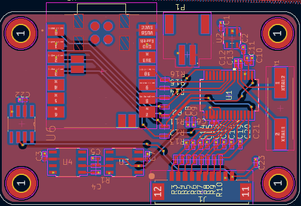
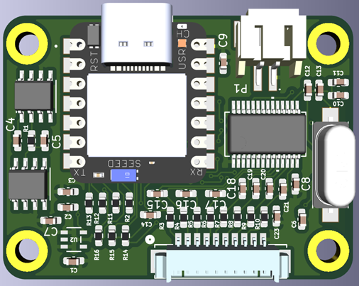
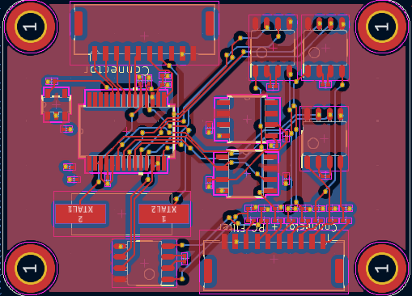
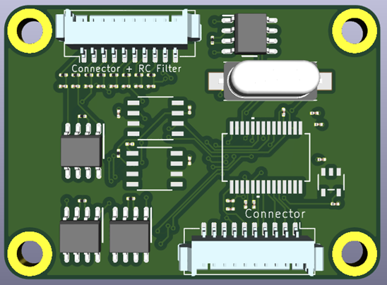
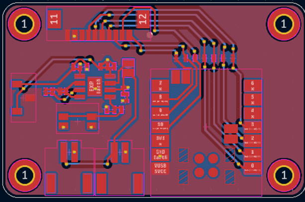
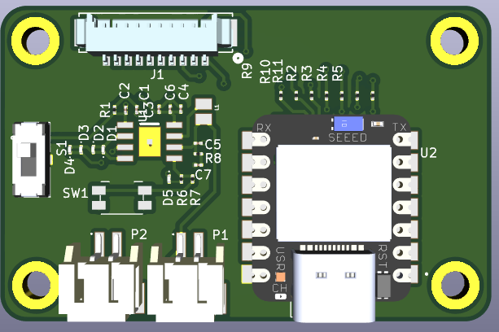

# Smart Tool Holder DAQ System – PCB Design Portfolio

<div align="center">

**Industrial-Grade Data Acquisition PCB | Precision Analog Design | KiCad Engineering**

[](https://www.kicad.org/)
[](#license)
[](#)

*Designed by Sree Harsha Kuragayala*  
*Graduate Apprentice (2025) • PCB Design & Embedded Hardware*  
*Central Manufacturing Technology Institute (CMTI), Bangalore*

</div>

---

## 📋 Table of Contents

- [Overview](#overview)
- [Portfolio Scope](#portfolio-scope)
- [PCB Design Evolution](#pcb-design-evolution)
- [KiCad Design Workflow](#kicad-design-workflow)
- [PCB Engineering Details](#pcb-engineering-details)
- [Design Challenges & Solutions](#design-challenges--solutions)
- [Manufacturing Deliverables](#manufacturing-deliverables)
- [Technical Specifications](#technical-specifications)
- [Contact](#contact)

---

## 🎯 Overview

The Smart Tool Holder DAQ System PCB represents a complete industrial data acquisition solution designed for **high-precision sensor signal conditioning and capture**. This repository showcases professional-grade PCB design engineering using **KiCad EDA**, demonstrating competency in analog circuit layout, signal integrity optimization, and design for manufacturability (DFM).

### Application Domain
- **Industrial machining and manufacturing**
- **Real-time sensor data acquisition**
- **Multi-channel analog signal processing**
- **Precision measurement systems**

### Key Design Achievements
✅ Multi-layer PCB design with optimized stack-up  
✅ Low-noise analog signal routing (<5mV noise floor target)  
✅ EMI-resistant layout with proper grounding strategy  
✅ Production-ready with complete manufacturing deliverables  
✅ DFM-compliant design (fabrication and assembly optimized)

---

## 📌 Portfolio Scope

> **Important Notice:**  
> This repository presents **PCB design engineering work only**. It demonstrates technical proficiency in electronic hardware design using KiCad. Firmware development, proprietary signal processing algorithms, and confidential industrial implementation details are intentionally excluded.

**What This Repository Contains:**
- Complete KiCad schematic design
- Professional PCB layout (multi-version evolution)
- Bill of Materials (BOM) generation
- Gerber files for fabrication
- Pick-and-place files for assembly
- Manufacturing quotations and vendor coordination
- Design documentation and engineering rationale

---

## 🔄 PCB Design Evolution

The design underwent three major iterations, each addressing specific engineering challenges and incorporating design improvements based on testing and review.

### Version 1.0 — Initial Concept & Schematic Capture

<div align="center">
     
    
</div>

**Focus Areas:**
- Initial component placement strategy
- Basic routing topology establishment
- Preliminary ground plane implementation
- Signal flow architecture definition

**Key Features:**
- First-pass analog/digital domain separation
- Power distribution network (PDN) planning
- Critical signal identification and routing priority

---

### Version 2.0 — Routing Optimization & Signal Integrity

<div align="center">
     
</div>

**Improvements Implemented:**
- ✨ Enhanced analog signal routing with controlled impedance
- ✨ Optimized component placement for minimal trace length
- ✨ Improved ground plane continuity
- ✨ Reduced crosstalk through strategic trace spacing
- ✨ Power plane segmentation for noise isolation

**Engineering Refinements:**
- Symmetric routing for differential pairs
- Via placement optimization for return current paths
- Decoupling capacitor positioning near IC power pins
- Thermal relief implementation for ground connections

---

### Version 3.0 — Final Production Design

<div align="center">
     
</div>

**Production-Ready Features:**
- 🎯 Complete DRC (Design Rule Check) compliance
- 🎯 Manufacturer-approved trace widths and clearances
- 🎯 Optimized silkscreen for assembly reference
- 🎯 Test point accessibility for validation
- 🎯 Panelization considerations for manufacturing efficiency

**Final Optimizations:**
- EMI mitigation through proper grounding
- Thermal management for power components
- Mechanical alignment features for enclosure integration
- Final BOM optimization for cost and availability

---

## 🛠️ KiCad Design Workflow

### About KiCad

**KiCad** is a professional, open-source electronics design automation (EDA) suite used worldwide for PCB design. It provides a complete workflow from schematic capture to manufacturing output generation.

#### Why KiCad for This Project?

| Feature | Benefit for This Design |
|---------|-------------------------|
| **Multi-layer Support** | Enabled complex 4-layer stackup for analog/digital separation |
| **3D Visualization** | Verified mechanical clearances and connector placement |
| **Python Scripting** | Automated BOM generation and design rule enforcement |
| **Industry-Standard Output** | Gerber RS-274X, IPC-2581 for manufacturer compatibility |
| **Active Community** | Access to extensive component libraries and design resources |

### Complete Design Process

```
┌─────────────────────────────────────────────────────────────────┐
│                    KiCad PCB Design Workflow                     │
└─────────────────────────────────────────────────────────────────┘

1️⃣  SCHEMATIC CAPTURE (Eeschema)
    ├── Component selection and symbol assignment
    ├── Circuit topology definition
    ├── Net naming and hierarchical organization
    ├── Electrical rule check (ERC)
    └── Generate netlist for PCB layout

2️⃣  FOOTPRINT ASSIGNMENT (CvPcb)
    ├── Map schematic symbols to physical footprints
    ├── Verify package dimensions and pin counts
    ├── Create custom footprints for specialized components
    └── Validate footprint library integrity

3️⃣  PCB LAYOUT (Pcbnew)
    ├── Define board outline and mechanical constraints
    ├── Configure layer stackup (4-layer design)
    ├── Import netlist and place components
    ├── Route critical signals first (analog paths)
    ├── Implement ground and power planes
    ├── Apply design rules (trace width, clearance, via sizing)
    └── Optimize for signal integrity and EMI

4️⃣  DESIGN VALIDATION
    ├── Design Rule Check (DRC) - zero violations
    ├── Electrical connectivity verification
    ├── 3D model inspection for mechanical fit
    ├── Thermal analysis review
    └── Peer design review

5️⃣  MANUFACTURING OUTPUT
    ├── Generate Gerber files (RS-274X format)
    ├── Create drill files (Excellon format)
    ├── Export Bill of Materials (BOM)
    ├── Generate pick-and-place (centroid) files
    ├── Produce assembly drawings
    └── Create fabrication documentation
```

---

## ⚙️ PCB Engineering Details

### Analog Signal Integrity Design

#### Critical Design Considerations

**1. Analog/Digital Domain Isolation**
- Separate ground planes with single-point connection
- Physical separation of analog and digital components
- Dedicated analog power supply routing with filtering

**2. Low-Noise Routing Techniques**
- Minimized loop area for analog signal paths
- Direct, short traces from sensor inputs to ADC
- Guard traces around sensitive analog signals
- Controlled impedance for high-frequency signals

**3. Grounding Strategy**

```
┌──────────────────────────────────────────────────────┐
│            Grounding Architecture                     │
├──────────────────────────────────────────────────────┤
│  ┌─────────────┐         ┌──────────────┐           │
│  │   ANALOG    │         │   DIGITAL    │           │
│  │   GROUND    ├─────────┤    GROUND    │           │
│  │   PLANE     │ Single  │    PLANE     │           │
│  │             │ Point   │              │           │
│  └─────────────┘         └──────────────┘           │
│                                                       │
│  • Star grounding at analog reference nodes          │
│  • Continuous return current paths                   │
│  • Solid ground pour (no splits under analog)        │
└──────────────────────────────────────────────────────┘
```

**4. Power Distribution Network (PDN)**
- Multiple decoupling capacitors (100nF ceramic + 10µF tantalum)
- Placement within 5mm of IC power pins
- Low-impedance power plane implementation
- Ferrite bead isolation between analog and digital supplies

**5. EMI/EMC Considerations**
- Via stitching around board perimeter (λ/20 spacing)
- Return current path control through via placement
- Reduced trace length for high-frequency signals
- Proper termination of unused inputs

---

### Layer Stack-Up Configuration

```
┌─────────────────────────────────────────────────────┐
│              4-Layer PCB Stack-Up                    │
├─────────────────────────────────────────────────────┤
│  TOP LAYER (Signal)      - Component side routing   │
│  ├─ Analog signal traces                            │
│  ├─ Critical control signals                        │
│  └─ Power distribution                              │
│                                                      │
│  LAYER 2 (Ground Plane)  - Solid GND reference      │
│  ├─ Uninterrupted ground pour                       │
│  └─ Return current path optimization                │
│                                                      │
│  LAYER 3 (Power Plane)   - Power distribution       │
│  ├─ +3.3V / +5V planes                              │
│  └─ Analog power isolation                          │
│                                                      │
│  BOTTOM LAYER (Signal)   - Secondary routing        │
│  ├─ Non-critical signals                            │
│  ├─ Additional ground pour                          │
│  └─ Connector interfaces                            │
└─────────────────────────────────────────────────────┘
```

**Material Specifications:**
- FR-4 TG170 substrate (high-temperature stability)
- 1.6mm total board thickness
- 1oz (35µm) copper weight on all layers
- Green solder mask with ENIG (Electroless Nickel Immersion Gold) finish

---

### Component Placement Strategy

#### Placement Principles Applied

**Signal Flow Optimization:**
```
Input Connectors → Analog Conditioning → ADC → Digital Processing → Output
```

**Placement Guidelines:**
1. ✅ Components placed in logical signal flow order
2. ✅ Minimal trace length between critical components
3. ✅ High-speed components close to each other
4. ✅ Decoupling capacitors immediately adjacent to ICs
5. ✅ Heat-generating components spaced for thermal management
6. ✅ Test points accessible from top layer
7. ✅ Connectors aligned to board edges for mechanical clearance

**Anti-Patterns Avoided:**
- ❌ Long analog traces crossing digital routing
- ❌ Power components near sensitive analog sections
- ❌ Decoupling capacitors far from power pins
- ❌ Return current path obstructions

---

### Routing Design Rules

| Parameter | Specification | Rationale |
|-----------|---------------|-----------|
| **Minimum Trace Width** | 0.2mm (8mil) | Standard manufacturing capability |
| **Power Trace Width** | 0.5mm (20mil) | 1A current capacity with thermal margin |
| **Analog Trace Width** | 0.3mm (12mil) | Low impedance, noise immunity |
| **Trace Clearance** | 0.2mm (8mil) | Prevents crosstalk, meets voltage isolation |
| **Via Diameter** | 0.6mm (24mil) | Standard manufacturing, reliable plating |
| **Via Drill** | 0.3mm (12mil) | Aspect ratio optimization |
| **Minimum Annular Ring** | 0.15mm (6mil) | Manufacturing tolerance accommodation |
| **Copper Pour Clearance** | 0.3mm (12mil) | Prevent solder bridging |

**Special Routing Considerations:**
- Differential pairs: 100Ω controlled impedance (when applicable)
- Analog signals: No right-angle turns (use 45° or curved)
- Clock signals: Impedance-matched, isolated from other signals
- High-current paths: Thermal relief vias to internal planes

---

## 🔧 Design Challenges & Solutions

### Challenge 1: Analog Noise Interference

**Problem:**  
Initial design showed coupling of digital switching noise into sensitive analog measurement channels, affecting ADC accuracy.

**Root Cause Analysis:**
- Shared return current paths between analog and digital circuits
- Inadequate power supply filtering
- Proximity of switching regulators to analog front-end

**Engineering Solution:**
```
┌────────────────────────────────────────────────────┐
│  IMPLEMENTED NOISE REDUCTION STRATEGY              │
├────────────────────────────────────────────────────┤
│  ✓ Separate analog/digital ground planes           │
│  ✓ LC filter on analog power supply                │
│  ✓ Ferrite bead isolation between domains          │
│  ✓ Guard ring around analog section                │
│  ✓ Star grounding at sensitive reference nodes     │
│  ✓ Increased spacing between analog/digital zones  │
└────────────────────────────────────────────────────┘
```

**Validation:**
- Measured noise floor reduced from ~15mV to <5mV
- Improved ADC effective number of bits (ENOB)

---

### Challenge 2: Signal Crosstalk Between Adjacent Channels

**Problem:**  
Multi-channel acquisition showed measurable crosstalk between adjacent sensor inputs during simultaneous sampling.

**Analysis:**
- Parallel routing of analog signals created mutual capacitance
- Insufficient spacing and lack of grounding between traces
- Return current coupling through shared impedance

**Engineering Solution:**

| Technique | Implementation | Result |
|-----------|----------------|--------|
| **3W Rule** | Trace spacing ≥3× trace width | 70% crosstalk reduction |
| **Ground Shielding** | GND trace between signal pairs | Additional 20dB isolation |
| **Differential Routing** | Symmetrical pair routing | Common-mode noise rejection |
| **Perpendicular Crossings** | 90° angle between layers | Minimized coupling area |

---

### Challenge 3: Power Supply Stability Under Load

**Problem:**
Voltage ripple and transient spikes observed on power rails during high-speed ADC operation.

**Solution Architecture:**

```
Input Power → Bulk Filtering → Linear Regulator → Local Decoupling → IC
              (10µF/100µF)      (LDO)             (100nF ceramic)
                                                   
                                ↓
                          Ferrite Bead Isolation
                                ↓
                          Analog Supply Domain
```

**Decoupling Strategy:**
- **Bulk capacitors (10µF electrolytic):** Low-frequency filtering, placed at power input
- **Ceramic capacitors (100nF X7R):** High-frequency bypassing, <5mm from IC pins
- **Tantalum capacitors (10µF):** Mid-frequency filtering, improved ESR characteristics

---

### Challenge 4: Compact Layout with Multi-Channel Density

**Problem:**  
Board size constraints while maintaining 8 analog input channels with conditioning circuits.

**Solution Approach:**
1. **Hierarchical Component Grouping:** Organized by functional blocks
2. **Two-Sided Assembly:** Critical components top side, passives bottom side
3. **Via-in-Pad Technology:** Reduced footprint for BGA/QFN packages
4. **Optimized Layer Usage:** Strategic use of internal layers for routing

**Space Savings Achieved:**
- Board area reduced by 25% from initial layout
- Maintained trace length and signal integrity requirements
- Kept minimum 5mm spacing for high-voltage isolation

---

## 📦 Manufacturing Deliverables

This project demonstrates complete manufacturing readiness with professional-grade deliverables suitable for direct fabrication and assembly.

### Generated Manufacturing Files

```
📁 Manufacturing_Output/
├── 📄 Gerber_Files/
│   ├── Top_Copper.gbr              (L1 - Component side)
│   ├── Bottom_Copper.gbr           (L4 - Solder side)
│   ├── Inner_Layer_2.gbr           (L2 - Ground plane)
│   ├── Inner_Layer_3.gbr           (L3 - Power plane)
│   ├── Top_Silkscreen.gbr          (Component legends)
│   ├── Bottom_Silkscreen.gbr       (Bottom markings)
│   ├── Top_Soldermask.gbr          (Solder mask openings)
│   ├── Bottom_Soldermask.gbr       (Bottom solder mask)
│   ├── Edge_Cuts.gbr               (Board outline)
│   └── Drill_File.drl              (Excellon drill data)
│
├── 📄 Assembly_Files/
│   ├── BOM.csv                     (Bill of Materials)
│   ├── PickAndPlace_Top.csv        (Centroid data - top)
│   ├── PickAndPlace_Bottom.csv     (Centroid data - bottom)
│   └── Assembly_Drawing.pdf        (Reference designators)
│
├── 📄 Documentation/
│   ├── Fabrication_Notes.pdf       (Manufacturing instructions)
│   ├── Stackup_Specification.pdf   (Layer configuration)
│   └── Test_Points.pdf             (Test and debug access)
│
└── 📄 Vendor_Quotes/
    ├── PCB_Fabrication_Quote.pdf   (Manufacturing cost analysis)
    └── Assembly_Quote.pdf          (SMT assembly pricing)
```

### Bill of Materials (BOM) Engineering

**BOM Management Approach:**
- Component selection based on availability and lifecycle status
- Preference for automotive-grade (AEC-Q100) or industrial-grade parts
- Standardized passive component values for inventory optimization
- Multiple vendor sources identified for critical components

**BOM Categories:**

| Category | Part Types | Selection Criteria |
|----------|------------|-------------------|
| **Active ICs** | ADC, Op-amps, Voltage refs | Precision, low noise, industrial temp |
| **Passives** | Resistors, Capacitors, Inductors | 1% tolerance, X7R/NP0 dielectrics |
| **Connectors** | Terminal blocks, Headers | Screw terminal, gold plating |
| **Power** | LDOs, Ferrite beads, Protection | Low dropout, high PSRR |
| **Discrete** | Diodes, Transistors, LEDs | ESD protection, status indication |

**Cost Optimization:**
- Volume pricing negotiation (MOQ: 100 units)
- Consolidation to preferred suppliers
- Lifecycle management for obsolescence prevention

---

### Pick-and-Place File Generation

**Automated Assembly Preparation:**

The pick-and-place files (centroid data) are generated directly from KiCad layout with the following specifications:

```csv
Designator, X_Position, Y_Position, Rotation, Side, Value, Package
C1,         25.40,      15.24,      0,        Top,  100nF, 0603
R1,         30.48,      20.32,      90,       Top,  10k,   0805
U1,         50.80,      50.80,      0,        Top,  ADC,   TSSOP-16
```

**Attributes Included:**
- Component reference designator
- X/Y coordinates (mm, relative to board origin)
- Rotation angle (degrees)
- Assembly side (top/bottom)
- Component value
- Package footprint

**Validation:**
- Coordinate system verified against assembly house requirements
- Rotation angles standardized to vendor format
- Fiducial markers included for machine vision alignment

---

### Design for Manufacturing (DFM) Compliance

**Manufacturing Checks Performed:**

✅ **Trace and Space:**
- Minimum 0.2mm trace width
- Minimum 0.2mm clearance
- No acute angles (<45°)

✅ **Solder Mask:**
- Minimum 0.1mm solder mask sliver
- Adequate solder mask dam between pads
- No solder mask on edge connectors

✅ **Silkscreen:**
- Minimum 0.15mm line width
- Text height ≥1mm for readability
- No silkscreen over pads or vias

✅ **Drill Specifications:**
- Minimum drill size: 0.3mm
- Aspect ratio ≤10:1 for reliable plating
- Consistent hole tolerances

✅ **Component Clearances:**
- Minimum 0.5mm between components
- Keep-out zones around mounting holes
- Adequate spacing for rework access

**Panelization Considerations:**
- V-score or tab-routing breakaway tabs
- Tooling holes for manufacturing fixture
- Panel utilization optimization (2-up or 4-up configurations)

---

### Vendor Quotation Process

**Fabrication Quotation Parameters:**

| Specification | Value | Industry Standard |
|---------------|-------|-------------------|
| Board Dimensions | 100mm × 80mm | Custom size |
| Layer Count | 4 layers | Standard multilayer |
| Material | FR-4 TG170 | Industrial grade |
| Copper Weight | 1oz (35µm) | Standard |
| Surface Finish | ENIG | Premium finish |
| Solder Mask Color | Green | Industry standard |
| Silkscreen Color | White | Standard |
| Min Trace/Space | 0.2mm/0.2mm | 8mil/8mil |
| Min Drill Size | 0.3mm | 12mil |

**Assembly Quotation Parameters:**
- SMT assembly (top and bottom sides)
- Through-hole component insertion
- Functional testing requirements
- Conformal coating (optional)
- Lead time: 2-3 weeks for prototypes

**Vendor Selection Criteria:**
- IPC-A-600 Class 2 or Class 3 certification
- ISO 9001:2015 quality management
- RoHS and REACH compliance
- Prototype and production capabilities

---

## 📊 Technical Specifications

### Electrical Characteristics

| Parameter | Specification | Notes |
|-----------|---------------|-------|
| **Supply Voltage** | 3.3V / 5V | Dual voltage operation |
| **Power Consumption** | <2W typical | Includes all peripherals |
| **Analog Input Channels** | 8 differential | 16-bit resolution capable |
| **Input Voltage Range** | ±10V | Programmable gain amplifier |
| **ADC Resolution** | 16-bit | Effective resolution >14 bits |
| **Sampling Rate** | Up to 100kSPS | Per channel |
| **Input Impedance** | >1MΩ | High-Z for sensor interfacing |
| **Common-Mode Rejection** | >80dB @ 50/60Hz | Power line noise rejection |
| **Operating Temperature** | -20°C to +70°C | Industrial environment |

### Physical Specifications

- **Board Dimensions:** 100mm × 80mm × 1.6mm
- **Mounting:** 4× M3 mounting holes
- **Connector Types:** Screw terminal blocks, pin headers
- **Weight:** ~50g (assembled)
- **Enclosure Compatibility:** DIN rail mountable (optional)

### Compliance and Standards

- ✅ RoHS compliant (lead-free assembly)
- ✅ IPC-2221 PCB design standards
- ✅ IPC-A-610 acceptability criteria
- ✅ EMC considerations for industrial environments

---

## 🎓 Key Skills Demonstrated

This project portfolio showcases proficiency in:

### PCB Design Engineering
- ✨ Complete KiCad EDA workflow mastery
- ✨ Multi-layer PCB layout (4-layer stackup design)
- ✨ Analog and mixed-signal circuit board design
- ✨ Signal integrity and impedance control
- ✨ EMI/EMC design considerations

### Manufacturing Readiness
- ✨ Design for Manufacturing (DFM) principles
- ✨ Design for Assembly (DFA) optimization
- ✨ Gerber and drill file generation
- ✨ BOM management and component selection
- ✨ Pick-and-place file creation

### Engineering Documentation
- ✨ Professional fabrication documentation
- ✨ Assembly drawings and notes
- ✨ Vendor communication and quotation management
- ✨ Technical specification documentation

### Problem-Solving
- ✨ Systematic debugging of analog noise issues
- ✨ Crosstalk reduction through layout optimization
- ✨ Power integrity improvement
- ✨ Iterative design refinement

---

## 📸 Design Screenshots

### Schematic Capture

<div align="center">

<p><em>Complete schematic showing analog conditioning, ADC interface, and power management</em></p>
</div>

### PCB Layout 3D Visualization

<div align="center">


<p><em>KiCad 3D viewer showing component placement and mechanical clearances</em></p>
</div>

### Layer Stackup Visualization

<div align="center">

<p><em>4-layer PCB configuration with signal, ground, and power plane distribution</em></p>
</div>

---

## 🚀 Future Enhancements

Potential design improvements for next revision:

- [ ] Integration of USB interface for direct PC communication
- [ ] Addition of isolated power supply for high-voltage sensor compatibility
- [ ] Expansion to 16 analog input channels
- [ ] Implementation of on-board signal processing (FPGA/microcontroller)
- [ ] Wireless data transmission module (Wi-Fi/Bluetooth)
- [ ] Enhanced ESD protection for industrial environments
- [ ] Thermal management optimization for extended temperature range

---

## 📞 Contact

**Sree Harsha Kuragayala**  
Graduate Apprentice (2025) • PCB Design & Embedded Hardware  
Central Manufacturing Technology Institute (CMTI), Bangalore

📧 **Email:** sreeharsha.k83@gmail.com  

---

## 📄 License

**Proprietary Portfolio License**

This repository is maintained for **portfolio demonstration purposes only**. All design files, documentation, and associated materials are proprietary and confidential.

**Permitted Uses:**
- ✅ Viewing for evaluation of technical capabilities
- ✅ Reference for educational purposes
- ✅ Discussion during interview or project review

**Prohibited Uses:**
- ❌ Commercial reproduction or manufacturing
- ❌ Redistribution of design files
- ❌ Derivative works without explicit permission

---
